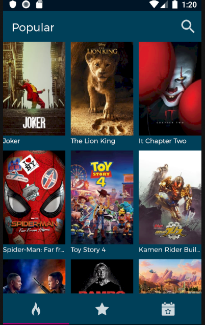
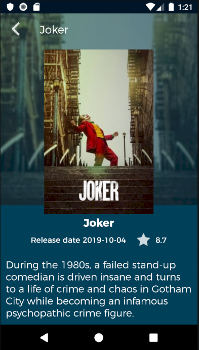
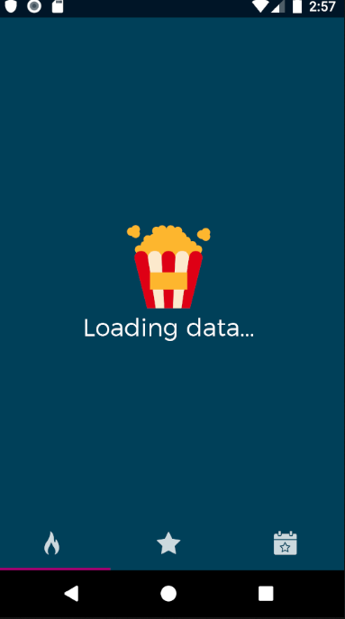
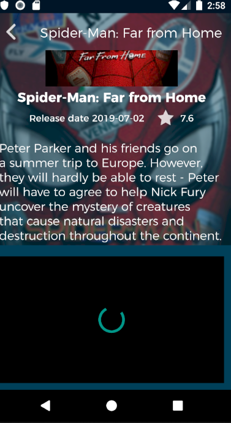
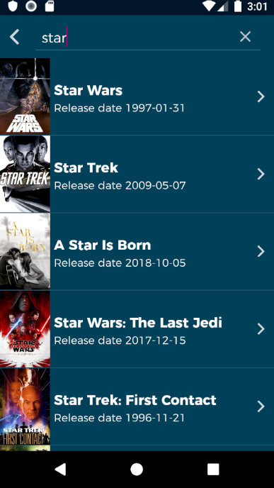
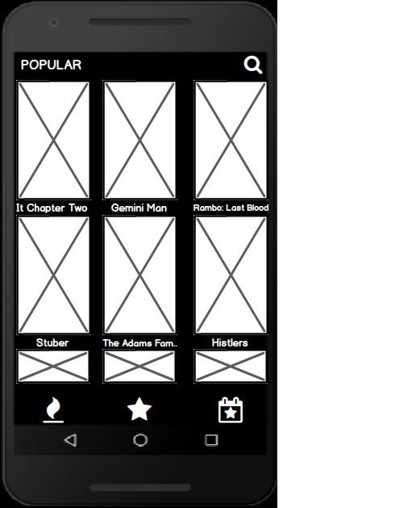
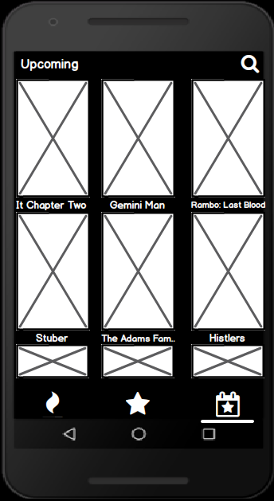
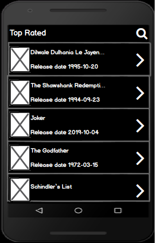
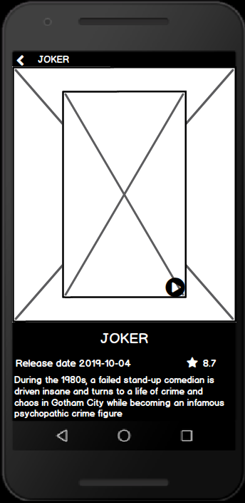

# MBillboard

Overviews, rating and trailers movies app.

## VIPER Architecture Pattern (View, Interactor, Presenter, Entity, Repository)

* **View:** Capa de interacción con el usuario.
* **Interactor:** Se encarga de responder las peticiones de datos ya sea de la memoria cache
en caso de no tener internet el dispositivo o de el API en caso contrario.    
* **Presenter:** Es el encargado de ser intermediario entre las capas de las otras capas de la aplicación
y la vista, en está capa se incluyen las reglas de negocio.
* **Entity:** Son todos lo modelos usados en la aplicación, objects, enums etc.
* **Repository:** Maneja el almacenamiento local.  

## 1. En qué consiste el principio de responsabilidad única? Cuál es su propósito?

Cada parte del código debe realizar solo una tarea en especifico.

## 2. Qué características tiene, según su opinión, un “buen” código o código limpio?

* Uso de los principios de SOLID
* Reutilización de código
* Código pensado para el testing
* Metodos y clases que solo realizen una tarea y tengan una razon de ser.
* Código pensado para escalar y refactorizar.
* Uso de interfaces en las declaraciones en vez de implementaciones.
* Utilizar patrones  creacionales, de comportamiento o arquitectura. Esto
de acuerdo a las necesidades del proyecto.

## APK

[AppCenter APK](https://install.appcenter.ms/users/alansolisflores-outlook.com/apps/mbilloboard/distribution_groups/public%20access)

## Libraries

* Retrofit
* Dagger 2
* Picasso
* Youtube Android Player
* Mockito
* Gson
* Realm

## Screenshots

## MockUps

